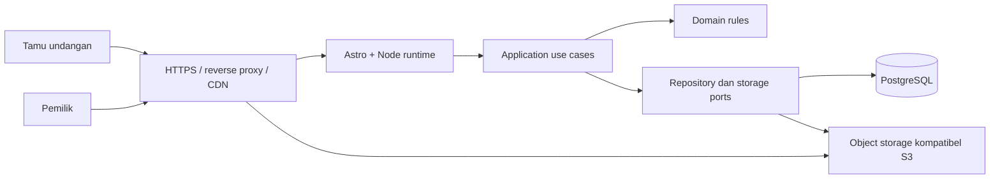

# Rencana Sistem Undangan Online

Status: proposal awal, belum implementasi.

## 1. Arah produk dan asumsi

Website undangan yang cepat dibuka di HP, nyaman di desktop, dan mudah dikelola tanpa mengedit kode. Astro menjadi pilihan utama karena halaman undangan dominan konten, dengan interaksi kecil seperti RSVP, musik, dan galeri.

Asumsi awal: platform mendukung banyak pemilik dan undangan, dimulai dari undangan pernikahan berbahasa Indonesia. Struktur tetap dapat diperluas untuk acara lain. Satu workspace dapat memiliki beberapa anggota dan undangan. Ini keputusan rancangan sementara, bukan kebutuhan yang sudah dikonfirmasi.

MVP mencakup:

- Login, workspace, dan dashboard pemilik.
- Editor berbasis form dan section, dengan preview desktop/mobile.
- Satu template premium yang selesai dengan baik sebelum menambah variasi.
- Cover, pasangan, jadwal acara, cerita, galeri, lokasi, RSVP, ucapan, dan penutup.
- Musik opsional; mulai setelah tindakan pengguna dan selalu bisa dimatikan.
- Daftar tamu, tautan personal, rekap RSVP, serta moderasi ucapan.
- Simpan draft, preview privat, publish, dan unpublish.
- Upload foto, metadata share, dan QR/link untuk dibagikan secara manual.
- Docker development dengan hot reload dan konfigurasi production terpisah.

Tahap berikutnya: beberapa template, custom domain, pembayaran/langganan, undangan multibahasa, check-in QR, dan pengiriman pesan terintegrasi. Amplop digital hanya menampilkan informasi pembayaran yang diisi pemilik; pemrosesan pembayaran bukan bagian MVP.

## 2. System design

Pendekatan: modular monolith. Frontend, endpoint, dan business logic berada dalam satu aplikasi dengan batas modul yang jelas. Tidak perlu microservices untuk MVP.



Stack yang diusulkan:

| Area | Pilihan | Alasan |
|---|---|---|
| Web | Astro + TypeScript strict | HTML server-first dan batas tipe yang jelas |
| Runtime | Adapter Node, standalone | Cocok untuk deployment Docker |
| Interaksi | Script kecil; React islands untuk editor kompleks | Halaman tamu tidak perlu memuat seluruh runtime editor |
| Styling | CSS variables + scoped CSS | Token desain terpusat, output ringan |
| Data | PostgreSQL + Drizzle ORM | Relasi, constraints, transaksi, dan migrasi bertipe |
| Validasi | Zod di batas input | Validasi runtime untuk form, endpoint, dan konfigurasi template |
| Auth | Library autentikasi terpelihara, kandidat Better Auth | Hindari membangun kriptografi dan sesi sendiri; kompatibilitas diverifikasi saat setup |
| Media | Storage kompatibel S3 | File tidak bergantung pada filesystem container |
| Ikon | Lucide SVG yang diimpor selektif | Tampilan bersih dan konsisten; bukan klaim aset berbayar |
| Verifikasi | Typecheck, lint, unit/integration terarah, Playwright | Memeriksa alur bisnis dan pengalaman pengguna |

Versi paket dipilih dan dikunci saat implementasi setelah memeriksa kompatibilitas Astro, adapter, Node LTS, dan library auth.

### Strategi rendering dan publishing

- Halaman marketing dan katalog template di-prerender.
- Dashboard, preview, autentikasi, dan API dirender sesuai request, tanpa shared cache.
- `/i/[slug]` memakai SSR dari revisi yang sudah dipublikasikan. Ini memungkinkan undangan baru terbit tanpa rebuild aplikasi.
- Awal MVP menggunakan SSR langsung dengan query terindeks. CDN cache HTML hanya diaktifkan setelah purge/invalidation teruji; aset publik berversi boleh dicache lama sejak awal.
- Draft disimpan terpisah dari snapshot publish. Publish memvalidasi semua section dan media, membuat revisi immutable, lalu mengganti pointer revisi aktif dalam transaksi.
- Unpublish menghentikan akses halaman dan menangani purge bila cache HTML kelak diaktifkan. Revokasi privasi tidak boleh bergantung pada cache kedaluwarsa.
- Nama tamu dan status RSVP tidak masuk HTML cache bersama. Tautan personal menukar token dengan sesi tamu, lalu mengarahkan ke URL bersih; endpoint personal menggunakan `private, no-store`.
- Undangan privat dan preview selalu diperiksa aksesnya sebelum konten/media dikirim. Jangan menyamakan slug sulit ditebak dengan autentikasi.

Astro mendukung HTML dengan islands interaktif serta rendering sesuai request melalui adapter. Referensi: [Islands architecture](https://docs.astro.build/en/concepts/islands/) dan [On-demand rendering](https://docs.astro.build/en/guides/on-demand-rendering/).

## 3. Layered architecture

| Layer | Tanggung jawab | Batasan |
|---|---|---|
| Presentation | Halaman Astro, komponen UI, endpoint, input/output HTTP | Tidak berisi query database atau aturan bisnis utama |
| Application | Use case: CreateInvitation, PublishInvitation, SubmitRsvp | Mengatur transaksi dan memanggil port |
| Domain | Entity, policy akses, validasi kapasitas tamu, status publish | Tidak bergantung pada Astro, ORM, atau HTTP |
| Infrastructure | Implementasi repository, auth, database, storage | Mengimplementasikan kontrak application/domain |

Alur request: endpoint memvalidasi input dan identitas, memanggil use case, lalu mengubah hasil menjadi respons. Use case tetap memeriksa otorisasi sehingga aman dipakai dari entry point lain.

Struktur awal:

```text
src/
  pages/                    # Route, endpoint, dan layout halaman
  components/
    ui/                     # Button, Input, Dialog, Toast, Icon
    invitation/             # Cover, EventCard, Gallery, RSVP
    dashboard/              # Sidebar, EditorPanel, PreviewFrame
  templates/
    editorial-botanical/    # Komposisi template pertama
  modules/
    invitations/
      domain/
      application/
      infrastructure/
    guests/
    rsvp/
    media/
    workspaces/
  server/                   # Auth, composition root, middleware
  shared/                   # Tipe/primitif yang benar-benar digunakan bersama
  styles/                   # Token, global, typography, motion
  assets/ornaments/          # SVG tepercaya, dikelola developer
db/
  schema/
  migrations/
tests/
  integration/
  e2e/
Dockerfile
compose.yaml
compose.production.yaml
.env.example
```

## 4. Clean code dan shared components

- Fungsi dan komponen berfokus pada satu tanggung jawab; gunakan nama berdasarkan domain.
- TypeScript strict, tanpa `any` yang tidak beralasan; validasi seluruh input eksternal.
- ORM hanya di infrastructure; dependency injection sederhana lewat composition root, tanpa framework DI besar.
- Central error mapping untuk validation, unauthorized, forbidden, not found, conflict, dan internal error.
- Konten, layout, token, dan data bisnis dipisahkan. Tidak ada warna atau spacing acak di tiap komponen.
- Konfigurasi template dan snapshot memiliki `schema_version` agar perubahan format dapat dimigrasikan.
- Tidak membuat abstraction generik sebelum ada kebutuhan nyata yang berulang.
- Formatter, linter, typecheck, dan pemeriksaan build menjadi gerbang CI.

Komponen bersama:

| Kelompok | Komponen |
|---|---|
| UI | Button, IconButton, Input, Select, Textarea, Dialog, Toast, EmptyState |
| Layout | Container, Section, Stack, Grid, DashboardShell |
| Undangan | Cover, CoupleProfile, EventCard, Countdown, Story, Gallery, MapLink, RsvpForm, Guestbook, MusicToggle |
| Editor | SectionEditor, MediaPicker, ThemeControls, DevicePreview, PublishDialog |
| Visual | Ornament, Divider, Monogram, ResponsiveImage |

Komponen berbagi token dan kontrak data, tetapi komposisi setiap template tetap bebas. Hindari satu komponen raksasa dengan puluhan flag.

## 5. Database schema

ID menggunakan UUID; timestamp disimpan sebagai `timestamptz`. Zona waktu acara disimpan sebagai nama IANA, misalnya `Asia/Makassar`, agar tampilan waktu dan countdown konsisten.

| Tabel | Kolom utama dan fungsi |
|---|---|
| users | id, name, email unik, email_verified_at, created_at; sesuaikan dengan library auth |
| auth_sessions / accounts / verifications | Struktur dikelola library auth; jangan menggandakan implementasi password/session |
| workspaces | id, name, created_at |
| workspace_members | workspace_id, user_id, role: owner/editor; unik gabungan |
| invitations | id, workspace_id, slug unik, title, template_key, status, visibility, timezone, published_revision_id, created_at, updated_at |
| invitation_drafts | invitation_id unik, schema_version, content_json, theme_json, lock_version, updated_by, updated_at |
| invitation_events | id, invitation_id, title, starts_at, ends_at, venue_name, address, map_url, sort_order; bagian draft terstruktur |
| invitation_revisions | id, invitation_id, revision_number, schema_version, snapshot_json, published_by, created_at; unik invitation_id + revision_number |
| media_assets | id, workspace_id, invitation_id, object_key unik, mime_type, bytes, width, height, visibility, processing_status, alt_text |
| revision_media | revision_id, media_asset_id; menjaga media revisi aktif tidak terhapus |
| guest_groups | id, invitation_id, display_name, max_attendees, token_hash unik, token_expires_at, revoked_at; satu grup untuk satu penerima/keluarga |
| rsvps | id, invitation_id, guest_group_id, attendance, attendee_count, note, updated_at; unik guest_group_id |
| wishes | id, invitation_id, guest_group_id nullable, author_display_name, message, moderation_status, created_at |
| audit_logs | id, workspace_id, actor_user_id, action, entity_type, entity_id, created_at; tanpa token atau konten sensitif |

Relasi inti: users berelasi many-to-many ke workspaces; workspace memiliki invitations; invitation memiliki draft, events, revisions, media, guest_groups, rsvps, dan wishes.

Aturan integritas:

- `published_revision_id` harus menunjuk revisi milik undangan yang sama, ditegakkan melalui composite foreign key.
- Snapshot publish menyalin konten, tema, acara, dan referensi media. Edit draft tidak langsung mengubah halaman publik.
- Relasi RSVP–guest dan media–revision harus tetap dalam undangan/workspace yang sama; gunakan composite constraints dan pemeriksaan use case.
- `attendee_count >= 0`; tidak hadir berarti 0; hadir minimal 1 dan maksimal kapasitas guest group. Batas lintas tabel diperiksa dalam transaksi.
- `ends_at >= starts_at` ketika end time tersedia.
- RSVP menggunakan upsert unik per guest group sehingga submit ulang memperbarui respons, bukan menggandakan jumlah.
- RSVP terverifikasi memakai token tamu. Pengunjung tautan umum tidak mendapat hak mengubah RSVP tamu lain.
- Index: invitations(workspace_id, updated_at), revisions(invitation_id, revision_number), guest_groups(invitation_id), wishes(invitation_id, moderation_status, created_at).
- Gunakan optimistic locking saat menyimpan draft untuk mencegah perubahan editor saling menimpa.
- Statistik MVP dihitung dari agregasi data; belum memerlukan analytics event per kunjungan.

## 6. UI/UX dan desain visual

Konsep pertama: **Editorial Botanical**. Nuansa undangan cetak premium: ivory hangat, teks gelap, aksen hijau zaitun, serif pada judul, sans-serif bersih pada isi, dan whitespace luas.

Token awal:

| Token | Nilai usulan |
|---|---|
| Background | `#F8F5EF` |
| Surface | `#FFFFFF` |
| Text | `#252923` |
| Primary | `#49533E` |
| Gold dekoratif | `#A88956`, bukan untuk teks kecil tanpa uji kontras |
| Border | `#DED8CC` |
| Spacing | Skala 4, 8, 12, 16, 24, 32, 48, 64, 96 px |
| Typography | Serif editorial + sans-serif; maksimal dua family dan sedikit weight |
| Ikon | Outline SVG konsisten, 20–24 px, label aksesibel |

Tidak menggunakan emoji pada UI. Kesan premium dibangun melalui tipografi, komposisi, ilustrasi, serta konsistensi ikon. Jika pengguna menginginkan paket ikon komersial tertentu, aset mengikuti lisensinya.

### Ornamen yang akan dibuat

- Botanical line art asli dalam SVG: sudut kiri/kanan dan aksen judul.
- Monogram inisial pasangan yang dapat dikonfigurasi.
- Divider tipis dan bingkai lengkung untuk foto utama.
- Tekstur kertas sangat halus berbasis CSS atau satu aset terkompresi bila dibutuhkan.
- Ornamen dekoratif memakai `aria-hidden`, tidak menutup teks, tidak menerima pointer event, dan berkurang pada layar kecil.
- SVG dipilih untuk ornamen garis karena tajam dan ringan. Ilustrasi raster hasil generasi baru dipertimbangkan pada tahap desain bila arah visual membutuhkannya; belum dibuat pada tahap planning.

### Alur tamu

1. Cover: nama pasangan, tanggal, penerima bila tautan personal, tombol Buka Undangan. HTML konten sudah tersedia; cover bukan loader animasi wajib.
2. Profil pasangan dan kalimat pembuka.
3. Jadwal, lokasi, tautan peta, dan tambah kalender.
4. Cerita serta galeri, dapat dinonaktifkan pemilik.
5. RSVP singkat dengan konfirmasi berhasil dan opsi memperbarui respons.
6. Ucapan yang sudah dimoderasi dan penutup.

Mobile memakai satu kolom, ukuran sentuh minimal 44 px, safe-area bawah, dan navigasi ringkas. Desktop memakai layout editorial dua kolom pada hero/profil dengan lebar baca terbatas. Jangan hanya membesarkan tampilan HP di tengah layar desktop.

Responsif diuji pada lebar 360, 390, 768, 1024, dan 1440 px, juga zoom teks. Animasi menggunakan opacity/transform secara terbatas, menghormati `prefers-reduced-motion`. Semua form memiliki label, pesan error yang jelas, focus ring, dan dapat digunakan dengan keyboard.

Peta memakai tautan eksternal atau dimuat setelah klik. Musik tidak autoplay sebelum tindakan pengguna. RSVP tetap mempunyai alur POST server sebagai fallback bila peningkatan JavaScript tidak berjalan.

### Alur pemilik

Dashboard → buat undangan → pilih template → isi data/acara → unggah foto → atur tema → preview mobile/desktop → publish → kelola tamu dan RSVP.

Desktop editor memakai panel pengaturan dan preview berdampingan. Mobile memakai tab Edit/Preview. Status tersimpan, belum tersimpan, gagal menyimpan, dan konflik edit harus terlihat. Publish menampilkan validasi konten wajib. Empty, loading, error, dan success state dirancang sejak awal.

## 7. Performa

Target berikut adalah acceptance budget awal, bukan hasil benchmark:

- LCP ≤ 2,5 detik, INP ≤ 200 ms, CLS ≤ 0,1 pada persentil ke-75 ketika trafik produksi cukup untuk pengukuran.
- Lighthouse mobile ≥ 90 untuk performance dan ≥ 95 untuk accessibility pada halaman representatif dengan kondisi uji terdokumentasi; audit manual tetap diperlukan.
- JavaScript awal halaman publik ditargetkan ≤ 50 KB gzip, tanpa memuat editor atau library animasi besar.
- Transfer awal halaman publik ditargetkan ≤ 500 KB, tidak termasuk media di bawah fold yang lazy-loaded dan audio setelah interaksi.
- Foto utama responsif, dimensi eksplisit, format modern dan fallback; preload hanya aset yang benar-benar kritis.
- Font self-hosted berlisensi sesuai, subset seperlunya, `font-display: swap`, sedikit weight.
- Thumbnail galeri dimuat bertahap; foto resolusi tinggi hanya saat dibuka.
- Media upload diproses menjadi ukuran terkontrol sebelum boleh dipublikasikan; batas ukuran dan concurrency mencegah beban berlebih. Worker terpisah ditambah bila volume membutuhkannya.
- Ukur TTFB dan query pada cache miss; target awal p95 respons SSR < 500 ms pada beban dan dataset uji yang disepakati saat implementasi.

## 8. Security dan privasi

- Cookie sesi HttpOnly, Secure di production, SameSite yang sesuai; proteksi CSRF untuk mutasi berbasis cookie dan verifikasi origin.
- Otorisasi workspace dan ownership di setiap use case, termasuk upload, preview, publish, dan endpoint laporan.
- Token tamu acak dengan entropi tinggi, hanya hash tersimpan, dapat dicabut; bukan ID berurutan. Batasi percobaan token dan jangan mencatat token pada log.
- Tautan token menggunakan kebijakan referrer ketat; tukar menjadi sesi dan bersihkan URL sebelum memuat resource pihak ketiga.
- Slug publik tidak dianggap rahasia. Halaman memakai noindex sebagai default privasi, tetapi noindex bukan kontrol akses.
- Konten pengguna berupa plain text atau format terstruktur; jangan menerima HTML/SVG mentah. SVG ornamen hanya berasal dari aset developer yang tepercaya.
- Validasi MIME berdasarkan isi, ukuran, dimensi, dan ekstensi upload; gunakan object key acak, buang metadata foto, tolak file berbahaya.
- Media draft/privat menggunakan bucket privat dan URL bertanda tangan singkat. Publikasi aset publik harus eksplisit.
- Rate limit login, token exchange, RSVP, ucapan, dan upload. Deployment multi-instance memerlukan penyimpanan limiter bersama atau dukungan ingress.
- Query terparameterisasi, validasi server, CSP, pembatasan embedding, dan security headers.
- Redaksi password, token, data tamu, dan payload sensitif pada log; audit perubahan penting dengan request ID.
- Secret hanya di environment/secret store; `.env` tidak masuk repository; akun database memakai hak minimum.
- Database tidak diekspos ke internet; backup terenkripsi dan uji restore sebelum production.
- Pemilik dapat menghapus data tamu; kebijakan retensi, akses media, dan pembersihan backup perlu ditentukan sebelum peluncuran.

## 9. Docker dan hot reload

Development memakai services:

| Service | Fungsi |
|---|---|
| web | Node + Astro dev server, bind `0.0.0.0:4321` |
| db | PostgreSQL dengan named volume dan healthcheck |
| storage | Service S3-compatible untuk pengujian upload lokal |

Rencana setup:

- Dockerfile multi-stage: `development`, `build`, dan `production`.
- Compose Watch menyinkronkan `src/` dan `public/`; Vite/Astro menangani HMR.
- Perubahan manifest/lockfile memicu rebuild; perubahan konfigurasi tertentu memicu restart bila perlu.
- Jangan sinkronkan `node_modules`, `.git`, build output, atau secret. Dependency Linux berada di container.
- Jalur yang sama tidak sekaligus memakai bind mount dan Compose sync.
- Fallback bind mount + polling hanya bila diperlukan pada lingkungan pengembang.
- Healthcheck database dan retry koneksi mencegah race saat startup. Migrasi dijalankan eksplisit, bukan reset database setiap restart.
- Development port dapat diakses dari HP satu Wi-Fi melalui IP LAN komputer untuk pengujian; layanan data tetap dibatasi lokal.
- Production menjalankan build Node standalone sebagai non-root, tanpa dev server/HMR atau source mount, di belakang HTTPS reverse proxy.
- Migrasi production dijalankan sebagai langkah deploy tunggal; backup dan rencana rollback mendahului perubahan destruktif.

Perintah yang ditargetkan setelah implementasi:

```sh
docker compose up --build --watch
docker compose exec web npm run db:migrate
docker compose exec web npm run db:seed
```

Perintah tersebut belum tersedia sekarang. Health/readiness endpoint, graceful shutdown, `.dockerignore`, `.env.example`, dan panduan onboarding termasuk deliverable implementasi.

Compose Watch mendukung sinkronisasi file dan rebuild untuk perubahan dependency: [Dokumentasi Docker](https://docs.docker.com/compose/how-tos/file-watch/).

## 10. Tahapan pengerjaan dan kriteria selesai

| Tahap | Hasil | Kriteria selesai |
|---|---|---|
| 1. Fondasi | Astro, TS strict, tokens, Docker, DB, CI dasar | Container sehat, perubahan source terlihat tanpa rebuild image, data bertahan setelah restart |
| 2. Desain publik | Template Editorial Botanical, SVG, komponen responsif | Semua section tampil baik di mobile/desktop, keyboard dan reduced motion berfungsi |
| 3. Data dan akses | Migrasi, auth, workspace, tenant isolation | Pemilik A tidak bisa mengakses/mengubah data pemilik B |
| 4. Editor dan publish | Form editor, media, preview privat, revisi publish | Draft tidak mengubah halaman live; publish atomik; unpublish menghentikan akses |
| 5. Tamu dan RSVP | Tautan personal, RSVP, ucapan, moderasi | Submit ulang tidak menggandakan data, batas tamu benar, token dapat dicabut |
| 6. Kesiapan rilis | Audit performa, aksesibilitas, keamanan, backup | Build/typecheck/lint lolos, alur utama E2E lolos, restore database berhasil |

Tes diprioritaskan pada aturan bisnis dan risiko: tenant isolation, publishing, concurrency draft, token tamu, submit RSVP ulang, batas kapasitas, serta validasi upload. Tidak perlu snapshot test setiap ornamen atau komponen dekoratif.

Keputusan yang masih bisa disesuaikan: platform untuk banyak pelanggan atau pemakaian pribadi; arah visual editorial botanical atau gaya budaya tertentu; aturan privasi undangan; provider storage/hosting; dan kebutuhan pembayaran. Rancangan awal tetap dapat dijalankan dengan asumsi MVP di atas.
